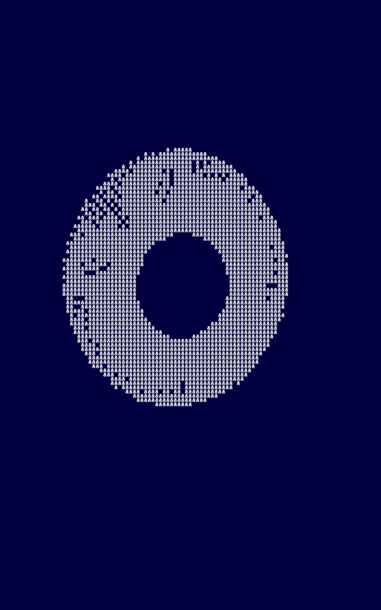
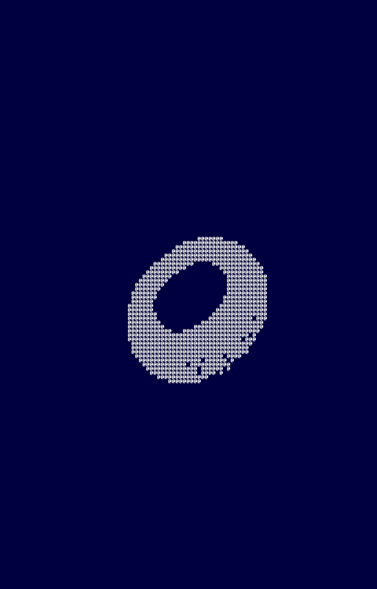
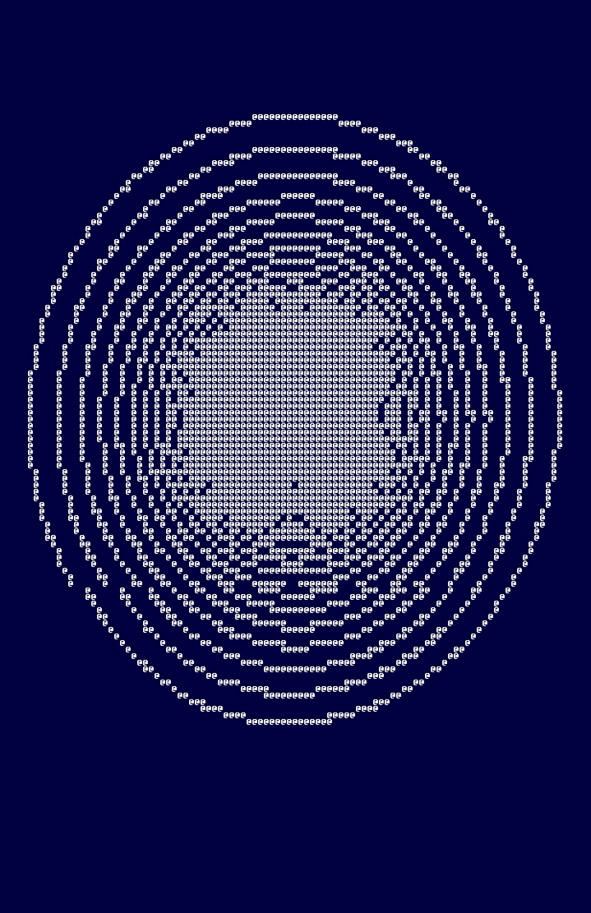
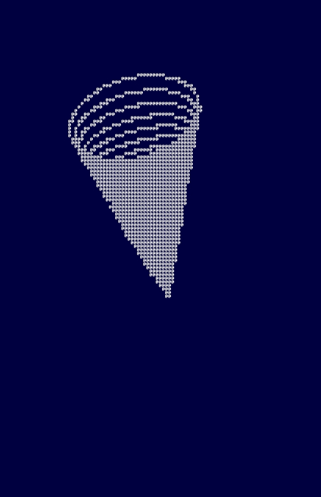
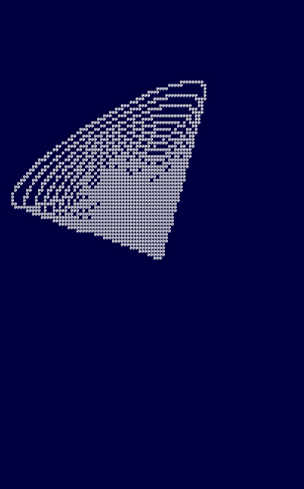
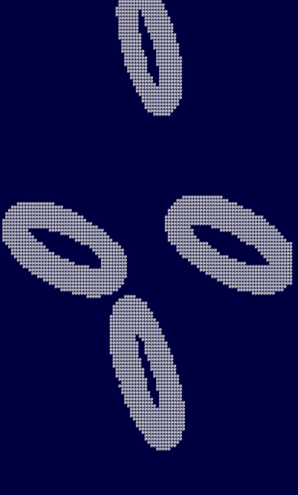
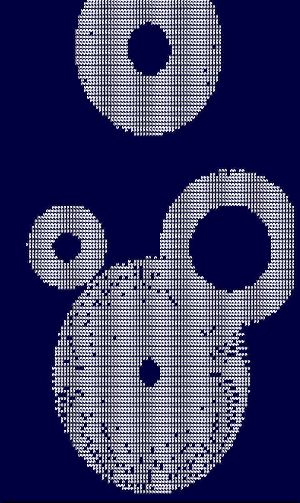

# Rasterization in the Terminal

**Generating 3D shapes using floating point numbers and spherical coordinates, then projecting them to a 2D screen to print them.**  

**Very interesting and an almost magical concept, a nice intro to graphics programming.**  
**The program I have made is very simple, working with arrays of points and continuously applying rotation matrices on them to simulate the motion of the donut.**  
**Note: I made this on termux on Android, plus on a square, aspect corrected font, so it might need to be fixed for other settings**

  

